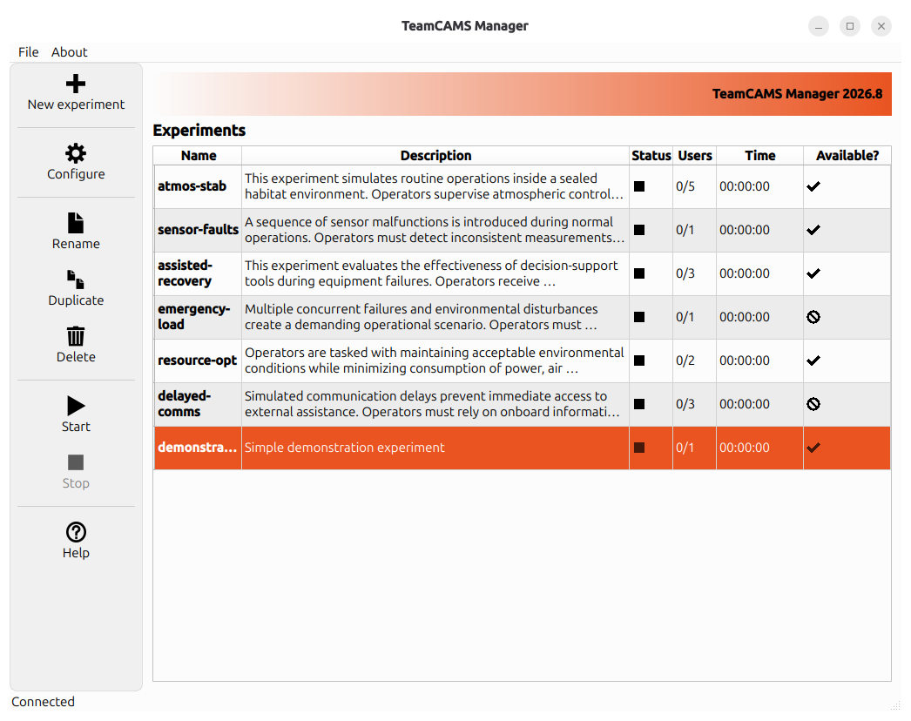
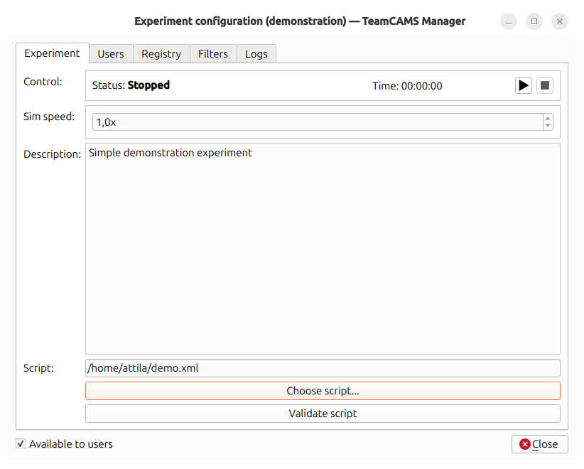
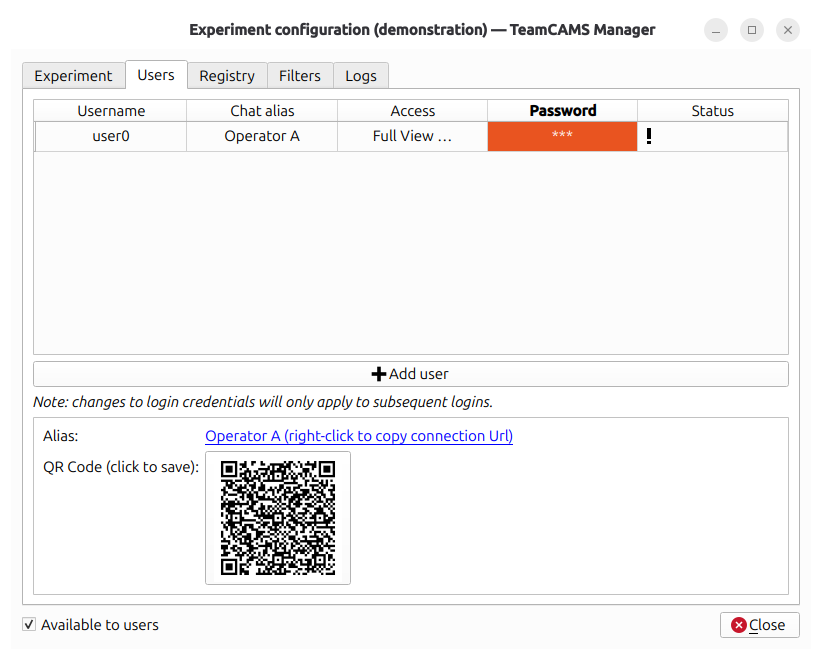

# TeamCAMS Experiment Manager

TeamCAMS (Team Cabin Air Management System) is the latest evolution of the AutoCAMS 2.0 research platform, extending its capabilities through a modern client-server architecture, web-based participation, distributed teamwork support, and advanced experiment management tools.

Developed for research in psychology, human factors, ergonomics, human-AI interaction, automation, and collaborative decision-making, TeamCAMS provides a flexible environment for conducting controlled experimental studies in complex socio-technical settings.

The TeamCAMS Experiment Manager is the researcher-facing, cross-platform application used to configure experimental scenarios, manage participant access, launch experimental sessions, and monitor data collection. Once an experiment has been configured, participants can join remotely through the web-based Operator Interface, enabling both laboratory and distributed online studies.

## Features

- Create and manage TeamCAMS experimental sessions.
- Configure experimental scripts and scenarios.
- Manage participant accounts and operator access.
- Run single-user or multi-user experiments.
- Support distributed experiments over the Internet.
- Monitor multiple experimental sessions.
- Collect and centralize experimental data and logs.
- Support studies involving teamwork, communication, and human-AI interaction.
- Compatible with desktop and mobile operator devices through the online operator interface.

## How It Works

A typical workflow consists of the following steps:

1. The researcher launches TeamCAMS Experiment Manager on a local computer.
2. An experimental script or scenario is selected.
3. Participant accounts and operator access permissions are configured.
4. The experiment is started from the manager.
5. A participation link is shared with external participants.
6. Participants join through the web-based operator interface without installing any software.
7. Experimental data and event logs are automatically collected during the session.
8. The generated log files are processed using the Log Processor.
9. Extracted datasets are imported into statistical or data analysis software.

This architecture allows researchers to conduct controlled experiments with geographically distributed participants while keeping the experiment management centralized.

## Screenshots

### Main Window

The main control panel used to manage experiments, connected participants, and running sessions.

### Experiment Configuration

Experiment settings, scenario selection, and study configuration.

### Operator Management

Participant and operator account configuration.

## TeamCAMS Ecosystem

The TeamCAMS platform consists of four main components:

### Experiment Manager

This application.

The researcher-facing tool used to configure and supervise experiments.

### Script Editor

A graphical editor used to create and modify TeamCAMS experimental scenarios and timelines.

Repository:

https://github.com/slashdotted/TeamCAMS-ScriptEditor

### Operator Interface

The participant-facing interface used during experimental sessions.

The operator interface is entirely web-based and does not require installation. Participants can join studies directly through a shared link using a modern web browser.

Repository:

https://github.com/slashdotted/TeamCAMS-OperatorInterface

### Log Processor

Used after data collection to process and extract information from TeamCAMS log files.

Repository:

https://github.com/slashdotted/TeamCAMS-LogProcessor

## Supported Platforms

Currently distributed for:

- Linux
- Windows

The platform has been designed as a cross-platform application.

## Background

The current TeamCAMS platform is the result of a long-term research and development effort. The latest generation introduces a client-server architecture, support for distributed teamwork, online participation, messaging tools, questionnaires, and advanced experiment configuration capabilities.

TeamCAMS Manager has been developed since 2015 by **Amos Brocco** as part of a collaboration between:

- Cognitive Ergonomics and Work Psychology Team, Department of Psychology, University of Fribourg, Switzerland
- Department of Innovative Technologies, University of Applied Sciences and Arts of Southern Switzerland (SUPSI)

The software is intended for scientific research in areas such as:

- Human-AI interaction
- Human-automation teaming
- Team decision-making
- Adaptive automation
- Process control
- Applied cognitive psychology
- Human factors and ergonomics

## License

TeamCAMS Experiment Manager is released under the terms of the GNU General Public License v3.0 (GPL-3.0).

See the `LICENSE.txt` file for details.

## Citation

If you use TeamCAMS in scientific work, please cite the corresponding TeamCAMS publication once available.

## Contacts

**Software development and project information**  
Amos Brocco  
Department of Innovative Technologies (SUPSI)  
Email: amos.brocco [at] supsi [dot] ch

**Scientific inquiries, research use, and collaborations**  
Cognitive Ergonomics and Work Psychology Team  
Department of Psychology, University of Fribourg, Switzerland  
https://www.unifr.ch/psycho/en/department/staff/teams/cogerg.html
